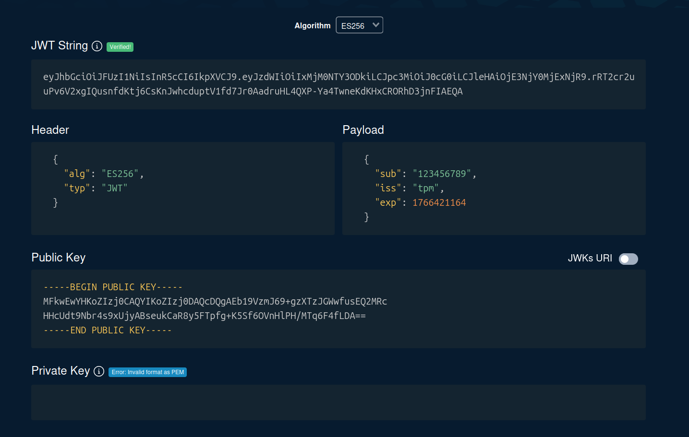

# TPM

## Features
The `getRandom.go` program connects to a TPM device (defaulting to `/dev/tpmrm0`) and retrieves 20 random bytes, which are then displayed in hexadecimal format.
In bash `tpm2_getrandom 20 --hex`

`sign.go` generates a signed JWT using an key stored in the TPM (at handle `0x81010001`).
* Algorithm: ES256 (ECDSA P-256 + SHA-256)
* The private key never leaves the TPM
* Only the public key is exported for verification.

## Requirements
To run these programs, you will need:
*   VirtualBox 7+ (supports TPM 2.0 emulation) or TPM 2.0

## Setup
The project includes a `Vagrantfile` that automatically prepares the testing environment:
1. Boots an Ubuntu Jammy 64-bit system.
1. Configures VirtualBox to emulate a TPM 2.0 device.
1. Installs necessary tools: `tpm2-tools` and the Go compiler.
1. Adds the user to the `tss` group to grant access to `/dev/tpmrm0`.

## How to Run

1. Start the virtual machine: `vagrant up`
1. Log in to the machine: `vagrant ssh`
1. Navigate to the project directory (mounted at `/vagrant`): `cd /vagrant`

### Running getRandom.go
```bash
go run getRandom.go
```

### Running sign.go

Note: `sign.go` expects an ECDSA key to be present at handle `0x81010001`.

```bash
go run sign.go
```

### Adding private key to TPM

`tpm2_getcap algorithms` - list supported algorithms

`tpm2_getcap handles-persistent` - list persistent handles

1. Create a primary key in TPM - `tpm2_createprimary -C o -G ecc -g sha256 -c primary.ctx`
2. Create a signing key: 
```bash 
tpm2_create \
-C primary.ctx \
-G ecc \
-g sha256 \
-a "sign|fixedtpm|fixedparent|sensitivedataorigin|userwithauth" \
-u sign.pub \
-r sign.priv
```
3. Load the key into the TPM:
```bash
tpm2_load \
-C primary.ctx \
-u sign.pub \
-r sign.priv \
-c sign.ctx
```
4. Make the key persistent: `tpm2_evictcontrol -C o -c sign.ctx 0x81010001`
5. Export the public key:
```bash
tpm2_readpublic \
-c 0x81010001 \
-f pem \
-o tpm_public.pem
```

#### Signing JWT

```bash
HEADER='{"alg":"ES256","typ":"JWT"}'
PAYLOAD='{"sub":"123","iss":"tpm","exp":1766416570}'
# build JWT
echo -n "$(echo -n $HEADER | base64url).$(echo -n $PAYLOAD | base64url)" > jwt.txt

# sign JWT
tpm2_sign \
-c 0x81010001 \
-g sha256 \
-o jwt.sig \
jwt.txt

# create final JWT
JWT="$(cat jwt.txt).$(base64url < jwt.sig)"

# display JWT token
echo "$JWT"
```

Go to the website [https://token.dev/](https://token.dev/)

Set the correct algorithm to ES256.
Paste content of file `tpm_public.pem` to "Public Key" input field.
Paste the JWT token to the "JWT String" input field.
You should see that the token is valid.


